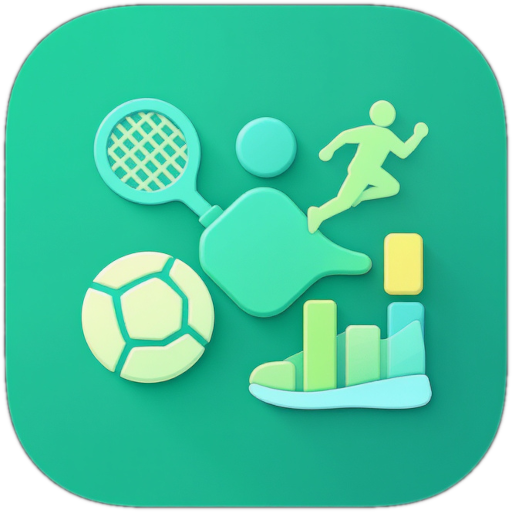

<p align="center">
  
</p>

<h1 align="center">⚽ Kaderblick</h1>

<p align="center">
  <strong>Die Web-App, die euren Fußballverein zusammenhält.</strong><br/>
  Termine · Spiele · Kommunikation · Statistiken · Organisation — alles an einem Ort.
</p>

<p align="center">
  
  
  
  
  
  
</p>

<p align="center">
  
  
</p>

---

## 💡 Warum Kaderblick?

Jeder Fußballverein kennt das Problem: **Trainingszeiten kursieren in drei WhatsApp-Gruppen**, Absagen kommen per SMS oder gar nicht, die Trikotgrößen stehen auf einem zerknitterten Zettel und ob der Spieler letzte Woche Gelb gesehen hat, weiß keiner mehr so genau.

**Kaderblick macht Schluss damit.**

Eine einzige Plattform — im Browser, auf dem Handy, ohne App-Store — die alles vereint, was ein Verein braucht. Entwickelt **von einem Vereinsmenschen für Vereinsmenschen**, mit echtem Verständnis dafür, wie Jugendtraining, Elternkommunikation und Spieltagsorganisation wirklich funktionieren.

---

## ✨ Was Kaderblick kann

<table>
<tr>
<td width="50%" valign="top">

### 📅 Kalender & Teilnahme
Vier Ansichten (Monat, Woche, Tag, Agenda), farbige Termintypen, Filter-Chips und **Ein-Klick-Zu-/Absagen**. Kein Hin-und-Her-Schreiben mehr — der Trainer sieht sofort, wer kommt.

### ⚽ Live-Spielverwaltung
Tore, Karten, Auswechslungen — alles in Echtzeit erfassen. Mit **13+ Ereignistypen**, Auswechslungsgründen (Taktik, Verletzung, Debüt, Abschied …) und automatischer Ergebnis-Aktualisierung.

### 🎬 Video-Analyse
YouTube-Videos einbetten, **Spielereignisse auf der Zeitleiste** markieren, per Fine-Tuning (±10 Sek.) exakt positionieren und im **Schnitt-Modus** Highlight-Clips erstellen. Inklusive CSV-Export.

### 🏆 Turniere
Gruppenphase, K.O.-Runden, Turnierbaum — komplett abgebildet. Mit Setzplätzen, Team-Filter und automatischem Vorrücken des Siegers in die nächste Runde.

### 📊 Bericht-Builder
**12+ Diagrammtypen** (Balken, Linien, Radar, Heatmap, Boxplot …), 20+ vorgefertigte Presets, frei kombinierbare Dimensionen und Metriken. Berichte speichern und direkt als Dashboard-Widget anzeigen.

</td>
<td width="50%" valign="top">

### 💬 Nachrichten & News
Posteingang mit Antwort-Funktion (Re: + Zitat), **Nachrichtengruppen**, Empfänger-Autocomplete. Dazu News-Artikel mit Sichtbarkeitsstufen (Plattform / Verein / Team).

### 📋 Aufgaben & Rotation
Wiederkehrende Aufgaben (wöchentlich oder **automatisch vor jedem Spiel**) mit fairer Spieler-Rotation. „Trikots waschen" regelt sich von selbst.

### 🚗 Fahrgemeinschaften
Wer fährt? Wie viele Plätze sind frei? Wer sitzt schon drin? Pro Kalender-Termin organisiert — **nie wieder 20 WhatsApp-Nachrichten** für eine Mitfahrgelegenheit.

### 🗳️ Umfragen
5 Fragetypen (Single/Multiple Choice, Freitext, Skala 1–5, Skala 1–10), **3-Schritte-Assistent**, teilbarer Link für externe Teilnehmer und Live-Auswertung.

### 🖥️ Personalisierbares Dashboard
5 Widget-Typen, **Drag & Drop** zum Anordnen, 5 Breitenoptionen (25% bis 100%). Jeder Nutzer richtet sich seine eigene Startseite ein.

### 🏅 XP-System & Titel
Punkte sammeln durch aktive Nutzung — Teilnahmen bestätigen, Aufgaben erledigen, Umfragen beantworten. Level aufsteigen, Titel freischalten. **Motivation durch Gamification.**

</td>
</tr>
</table>

---

## 👥 Für wen ist Kaderblick?

| | Rolle | Das bringt Kaderblick euch |
|---|---|---|
| 🧒 | **Spieler** | Termine im Blick, Aufgaben checken, XP sammeln, Statistiken angucken |
| 👨‍👩‍👧 | **Eltern** | Wissen, wann das Kind wo sein muss. Fahrgemeinschaften. Trainer-Kommunikation. |
| 🧑‍🏫 | **Trainer** | Aufstellungen planen, Spiele dokumentieren, Video-Analyse, Berichte erstellen |
| ⚙️ | **Admins** | Nutzer verwalten, Stammdaten pflegen, Feedback bearbeiten, XP-Regeln konfigurieren |

---

## 📱 Progressive Web App

Kaderblick ist eine **PWA** — installierbar auf jedem Gerät, direkt aus dem Browser:

- 📲 **Android**: Chrome → ⋮ → „Zum Startbildschirm hinzufügen"
- 🍎 **iPhone**: Safari → Teilen → „Zum Home-Bildschirm"
- 🖥️ **Desktop**: Chrome zeigt automatisch die Install-Aufforderung

Nach der Installation öffnet sich Kaderblick **im Vollbild** — ohne Adressleiste, wie eine native App. Push-Benachrichtigungen inklusive.

---

## 🏗️ Technologie

| Bereich | Stack |
|---------|-------|
| **Backend** | PHP 8.3 · Symfony 7 · Doctrine ORM · MySQL |
| **Frontend** | React 18 · TypeScript · Material UI 6 · Vite |
| **Auth** | JWT · Google OAuth 2.0 |
| **Echtzeit** | Push-Benachrichtigungen via Web Push API (VAPID) |
| **Visualisierung** | Chart.js · react-chartjs-2 (12+ Charttypen) |
| **Video** | react-youtube · Custom Timeline mit Drag & Fine-Tuning |
| **Drag & Drop** | @dnd-kit (Dashboard-Widgets, Formationen) |
| **Kalender** | react-big-calendar · Moment.js |
| **Infra** | Docker Compose · Nginx |

---

## 🚀 Lokale Entwicklung

```bash
# Repository klonen
git clone https://github.com/mastercad/kaderblick.git
cd kaderblick

# Docker-Stack starten (DB + App)
docker compose up -d

# Backend-Abhängigkeiten
cd api && composer install

# Datenbank migrieren
bin/console doctrine:migrations:migrate

# Frontend-Abhängigkeiten & Dev-Server
cd ../frontend && npm install && npm run dev
```

### Nützliche Befehle

```bash
# Tests
cd api && bin/phpunit

# Statische Analyse
bin/docker-phpstan
bin/docker-phpcs
bin/docker-php-cs-fixer

# Symfony-Konsole
bin/console debug:router
bin/console cache:clear
```

> Weitere Befehle und Details: [`api/COMMANDS.md`](api/COMMANDS.md)

---

## 📖 Dokumentation

Die vollständige **Benutzer-Dokumentation** (für Spieler, Eltern, Trainer und Admins) findet ihr hier:

> ### 📚 [**Zur Dokumentation →**](dokumentation/index.md)

<details>
<summary><strong>Alle Kapitel im Überblick</strong></summary>

<br/>

#### Einstieg
- [01 — Erste Schritte](dokumentation/01-erste-schritte.md) · Registrierung, Login, Navigation, PWA-Installation
- [02 — Authentifizierung](dokumentation/02-authentifizierung.md) · E-Mail, Google OAuth, Passwort-Reset

#### Vereinsstruktur
- [03 — Vereins- & Teamverwaltung](dokumentation/03-vereins-teamverwaltung.md) · Vereine, Teams, Altersgruppen, Standorte
- [04 — Spieler](dokumentation/04-spieler.md) · Profile, Positionen, Zuweisungen, Titel
- [05 — Trainer](dokumentation/05-trainer.md) · Profile, Lizenzen, Zugehörigkeiten

#### Spiele & Wettbewerb
- [06 — Spielverwaltung](dokumentation/06-spielverwaltung.md) · Live-Spiele, Ereignisse, Wetter, fussball.de
- [08 — Formationen](dokumentation/08-formationen.md) · Taktische Aufstellungen am Spielfeld
- [09 — Turniere](dokumentation/09-turniere.md) · Gruppen, Bracket, Setzplätze
- [10 — Video-Analyse](dokumentation/10-video-analyse.md) · YouTube, Zeitleiste, Schnitt-Modus

#### Termine & Organisation
- [07 — Kalender & Teilnahme](dokumentation/07-kalender-teilnahme.md) · 4 Ansichten, Filter, Zu-/Absagen
- [13 — Aufgaben](dokumentation/13-aufgaben.md) · Rotation, Pro-Spiel-Modus, Vertretung
- [18 — Fahrgemeinschaften](dokumentation/18-fahrgemeinschaften.md) · Fahrer, Plätze, Mitfahrer

#### Kommunikation
- [11 — Nachrichten](dokumentation/11-nachrichten.md) · Posteingang, Gruppen, Antworten
- [12 — News](dokumentation/12-news.md) · Vereinsnachrichten, Sichtbarkeit
- [14 — Umfragen](dokumentation/14-umfragen.md) · 5 Fragetypen, Wizard, Auswertung
- [15 — Benachrichtigungen](dokumentation/15-benachrichtigungen.md) · Push, In-App, Glocke

#### Auswertung & Personalisierung
- [16 — Dashboard](dokumentation/16-dashboard.md) · 5 Widgets, Drag & Drop, Breiten
- [17 — Berichte](dokumentation/17-berichte.md) · Builder, 12+ Charts, 20+ Presets
- [19 — Profil](dokumentation/19-profil.md) · Avatar, Push, Passwort, XP

#### Verwaltung
- [20 — Administration](dokumentation/20-admin.md) · Nutzer, Titel/XP, Feedback, Stammdaten

</details>

---

## 📂 Projektstruktur

```
kaderblick/
├── api/                    # Symfony Backend (PHP)
│   ├── src/
│   │   ├── Controller/     # API-Controller
│   │   ├── Entity/         # Doctrine-Entities (55+)
│   │   ├── Repository/     # Datenbank-Abfragen
│   │   └── Service/        # Business-Logik
│   ├── config/             # Symfony-Konfiguration
│   ├── migrations/         # Datenbank-Migrationen
│   ├── templates/          # Twig-Templates
│   └── tests/              # PHPUnit-Tests
├── frontend/               # React Frontend (TypeScript)
│   └── src/
│       ├── components/     # React-Komponenten
│       ├── pages/          # Seiten / Views
│       ├── services/       # API-Calls
│       └── hooks/          # Custom React Hooks
├── dokumentation/          # Benutzer-Dokumentation (20 Kapitel)
├── public/                 # Statische Assets
└── docker-compose.yml      # Docker-Setup
```

---

## 🤝 Mitwirken

Kaderblick ist aktuell ein privates Projekt. Bei Interesse an einer Zusammenarbeit oder Fragen zum Projekt gerne ein Issue erstellen oder direkt Kontakt aufnehmen.

---

## 📝 Lizenz

Dieses Projekt ist **nicht öffentlich lizenziert**. Alle Rechte vorbehalten.

---

<p align="center">
  <sub>Mit ❤️ gebaut für den Amateurfußball.</sub>
</p>
